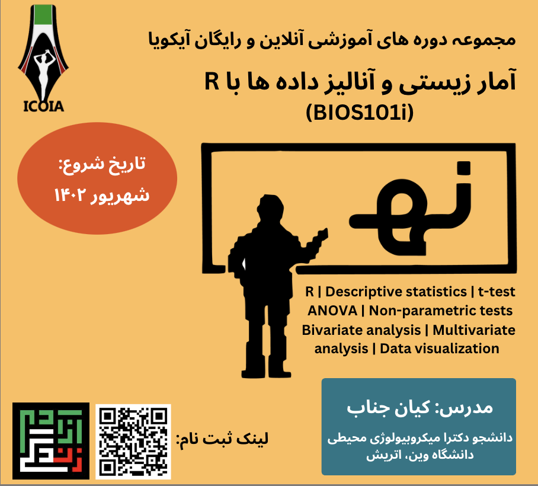

# Biostatistics and data analysis with R (BIOS101i)

<h2 id="general">General Information</h2>

  <strong>Code:</strong>
  <a>BIOS101</a>

  <strong>Instructor:</strong>
  <a href="https://ter.csb.univie.ac.at/people/kian-jenab">Kian Jenab </a>(Ph.D. candidate)

  <strong>Organized by:</strong>
  <a href="https://icoia.org">ICOIA </a>(International Community of Iranian Academics)

  <strong>Dates:</strong>
  September - November 2023

  <strong>Objective:</strong>
  Statistical data analysis using R

  <strong>Requirements:</strong> 

  - Laptop with a Mac, Linux, or Windows operating system 
    (not a tablet, Chromebook, etc.) with administrative privileges 
  - Access to Wifi 
  - R and Rstudio installed (instructions <a href="#setup">below</a>)
  - Excel or any text editor installed (e.g. TextWrangler, Notepad, BBEdit, etc.)
  

  <strong>Watch</strong>
  <a href="https://www.youtube.com/@icoia_official">here</a> 

  <strong>Contact:</strong>
  <a href="mailto:{{icoia.onlineschool@gmail.com}}">icoia.onlineschool@gmail.com</a> 

<h2 id="schedule">Schedule</h2>

This course is suitable for:

 - Levels: Beginner & Intermediate
 - Fields: Biology, Medicine, Agriculture & Natural Resources
 - Language: Farsi

This course covers the following material:

 - Introduction to R
 - Descriptive statistics
 - t-test
 - ANOVA
 - Non-parametric tests
 - Bivariate analysis
 - Multivariate analysis
 - Data visualization

<h2 id="setup">Setup</h2> 
To participate in this Workshop, please install the following <a href="#r">software</a>, 
complete the <a href="#r-course">R courses for beginners</a>, 
and let us know if you need any help before attending.

  <h3>Install R and RStudio</h3>
  

    <a href="http://www.r-project.org">R</a> is a free and open-source programming 
    language that is particularly powerful for data exploration, visualization, and 
    statistical analysis. We use <a href="https://posit.co/downloads/">RStudio</a> 
    to interact with R.
  

 
 

   

     <h4 id="r-windows">Windows</h4>
    

     Please download R for Windows
        from <a href="http://cran.r-project.org/index.html">CRAN</a> to install R, and 
        also install the <a href="http://www.rstudio.com/ide/download/desktop">RStudio IDE</a>.
        If you have separate user and admin accounts, please run the installers as an 
        administrator by right-clicking on the .exe file and selecting "Run as administrator" 
        instead of double-clicking. Otherwise, problems may arise later when installing R packages.
    

     <a href="https://www.youtube.com/watch?v=q0PjTAylwoU">Video Tutorial</a>
 
 
   
 

   
 
   <h4 id="r-macosx">Mac OS X</h4>
   

   

    Please download R for macOS
       from <a href="http://cran.r-project.org/index.html">CRAN</a> to install R, and also install 
       the <a href="http://www.rstudio.com/ide/download/desktop">RStudio IDE</a>.
   

    <a href="https://www.youtube.com/watch?v=5-ly3kyxwEg">Video Tutorial</a>
  
 
   
  

    <h4 id="r-linux">Linux (Debian, Fedora/Redhat, Ubuntu)</h4>
   

    Please download the binary files for your distribution from
    <a href="http://cran.r-project.org/index.html">CRAN</a> to install R, or use a package manager 
     (e.g. run <code>sudo apt-get install r-base</code> for Debian/Ubuntu and run
        <code>sudo yum install R</code> for Fedora/Redhat). Additionally, please install the
        <a href="http://www.rstudio.com/ide/download/desktop">RStudio IDE</a>.
   

  
 
  

  <h3>Install Discord</h3>
  

    Please download and install <a href="https://discord.com/download">Discord</a> for communications 
    and troubleshooting during the course.
  

 
   
 

   
<h3 id="r-course">R for beginners</h3>
To follow the workshop, you must have a basic understanding of R.
Before attending the workshop, please go through the following courses:

  - <a href="https://app.datacamp.com/learn/courses/free-introduction-to-r">Introduction to R (Chapter 1)</a> 
  - <a href="http://swcarpentry.github.io/r-novice-inflammation/">Programming with R</a>
 
